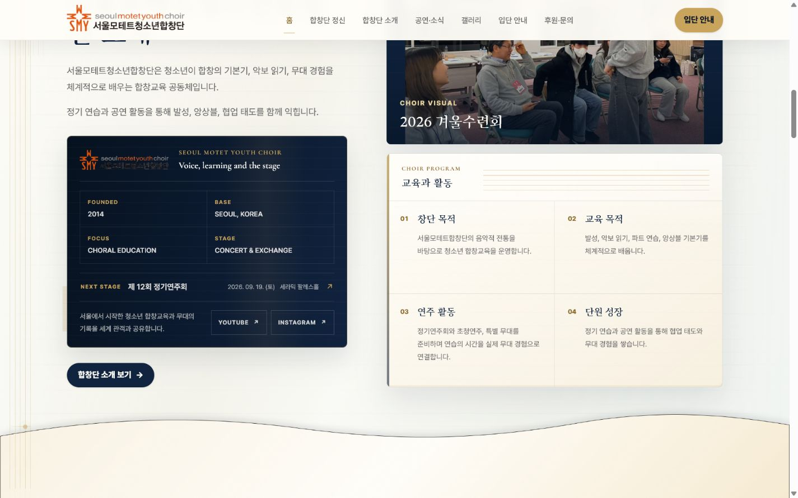
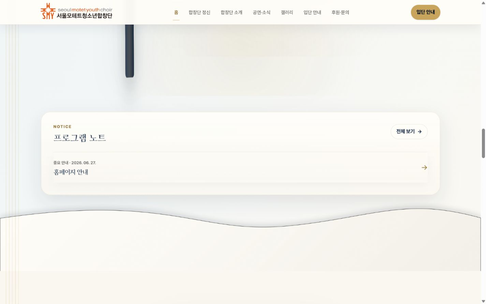
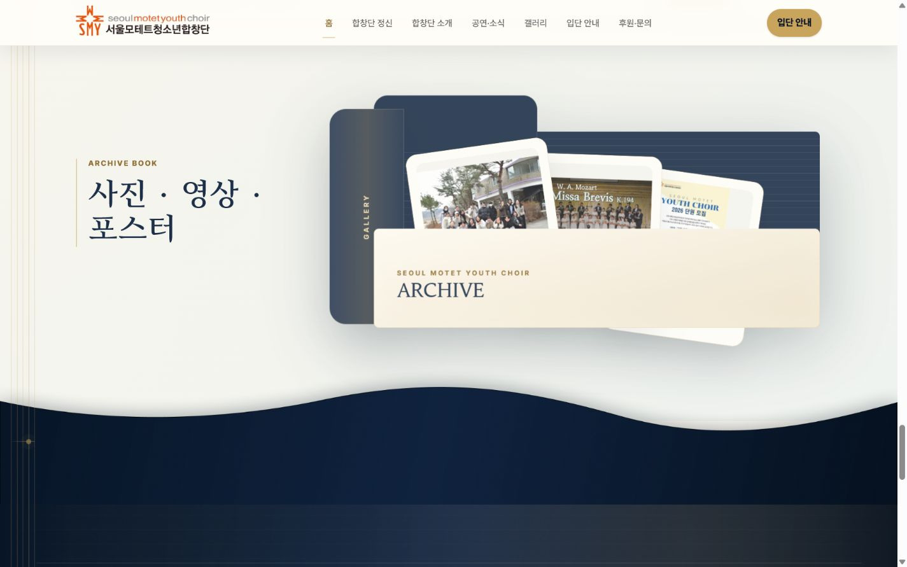
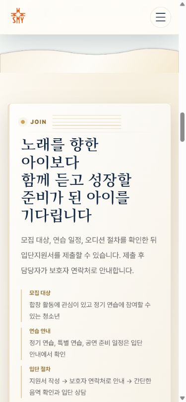

# Home Section Panel Design QA

## Sources

- Poster reference: `C:/Users/seong/Downloads/b797b8f0-d8b8-45dd-8e6a-2675b6d9bb00.jpg`
- Figma: https://www.figma.com/design/AygjhzdMga5w4ekLyTvbdo
- Figma panels: Quiet Paper Rise `6:7`, Stage Sheet Sweep `8:8`, Navy Curtain Handoff `9:7`
- Figma motion storyboard: `10:2`

## Visible Comparison

The poster uses broad material changes, soft paper edges, pale light, and a dark final chapter. The implementation keeps those qualities while preserving the existing Navy / Gold / Ivory identity.

| State | Implementation |
| --- | --- |
| About to Join |  |
| Concert to Motet Score |  |
| Archive to Support |  |
| Mobile static fallback |  |

## Decisions

- Used the actual Figma-exported PNG panels instead of approximating the curves in CSS.
- Moved each wave and its incoming section as one panel, so ornaments no longer animate independently from the section surface.
- Used `animation-fill-mode: backwards`; after entry, `translate` and `transform` return to `none` so the scorebook sticky containing block is unchanged.
- Continued each panel material behind its cards with matching low-contrast paper or navy textures.
- Kept mobile and tablet static. `prefers-reduced-motion: reduce` also disables panel motion.

## Browser QA

- 390px: no horizontal overflow; panel animation disabled; 58-62px static wave.
- 768px: no horizontal overflow; panel animation disabled; 76-82px static wave.
- 1024px: all three panels use a view timeline; no console error/warning.
- 1440px: no horizontal overflow; all three Figma assets render; score sticky is still `position: sticky` with `top: 72px`; no new console error/warning.
- `pnpm lint` equivalent: passed with project-local ESLint.
- `pnpm build` equivalent: Vite production build passed.

## Residual Risk

- Scroll-driven animation is progressive enhancement. Browsers without `animation-timeline: view()` receive the settled static panel.
- The Figma PNGs are intentionally wide. Very wide displays stretch them slightly, but the curves remain broad and the material does not tile or show seams.
